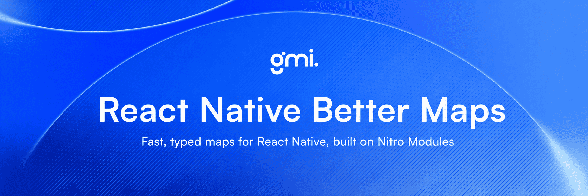

<div align="center">

Fast, typed maps for React Native, built on [Nitro Modules](https://nitro.margelo.com) and the New Architecture.

[](https://www.npmjs.com/package/react-native-better-maps)
[](https://github.com/gmi-software/react-native-nitro-maps/actions/workflows/ci.yml)
[](./LICENSE)


Built with [Nitro Modules](https://nitro.margelo.com/) for high-performance native map rendering.

[Features](#features) • [Installation](#installation) • [Quick start](#quick-start) • [Map providers](#map-providers) • [Documentation](#documentation) • [Public API](#public-api)

**Full documentation** lives in [`docs/`](docs). Start with [Expo setup](docs/expo-setup.md), [Architecture](docs/architecture.md), and [Roadmap](docs/roadmap.md).

</div>

---

## Table of contents

- [Features](#features)
- [iOS Apple Maps clustering comparison](#ios-apple-maps-clustering-comparison)
- [Android Google Maps clustering comparison](#android-google-maps-clustering-comparison)
- [Requirements](#requirements)
- [Supported platforms](#supported-platforms)
- [Installation](#installation)
- [Quick start](#quick-start)
- [Map providers](#map-providers)
- [Custom marker images](#custom-marker-images)
- [Google Maps setup](#google-maps-setup)
- [Marker entering animations](#marker-entering-animations)
- [Capability matrix](#capability-matrix)
- [Public API](#public-api)
- [Example app](#example-app)
- [Documentation](#documentation)
- [Common problems](#common-problems)
- [Development](#development)
- [What's next](#whats-next)

## Features

- **Performance first** - Nitro Modules and JSI power zero-bridge map interactions.
- **New Architecture native** - Built exclusively for React Native's New Architecture: Fabric + TurboModules.
- **Unified map API** - One typed React API for Apple MapKit and Google Maps SDK.
- **Provider-aware props** - TypeScript narrows provider-specific props with `MapViewPropsForProvider<P>`.
- **Markers and overlays** - Markers with title/subtitle callouts and drag support, plus polylines, polygons, and circles.
- **Camera control** - Declarative region/camera props plus imperative camera helpers.
- **Marker clustering** - Native marker clustering for large point sets.
- **Native entering animations** - Configurable marker and cluster entrance animations.
- **Expo friendly** - Config plugin for Google Maps API keys and location permissions.
- **Tree-shakeable package** - ESM-only build with an explicit `exports` map.

## iOS Apple Maps clustering comparison

The clips below compare the same iOS Apple Maps marker clustering scenario in
`react-native-better-maps` and `react-native-maps` with
`react-native-clusterer`.

<table>
  <tr>
    <th>react-native-better-maps</th>
    <th>react-native-maps + react-native-clusterer</th>
  </tr>
  <tr>
    <td>Native MapKit-backed clustering through the Nitro map provider.</td>
    <td>React Native Maps with JS-side clusterer integration.</td>
  </tr>
  <tr>
    <td>
      
      <br />
      <a href="./assets/react-native-better-maps-ios-apple-maps.gif">Open GIF</a>
    </td>
    <td>
      
      <br />
      <a href="./assets/react-native-maps-clusterer-ios-apple-maps.gif">Open GIF</a>
    </td>
  </tr>
</table>

## Android Google Maps clustering comparison

The clips below compare the same Android Google Maps marker clustering scenario
in `react-native-better-maps` and `react-native-maps` with
`react-native-clusterer`.

<table>
  <tr>
    <th>react-native-better-maps</th>
    <th>react-native-maps + react-native-clusterer</th>
  </tr>
  <tr>
    <td>Native Google Maps-backed clustering through the Nitro map provider.</td>
    <td>React Native Maps with JS-side clusterer integration.</td>
  </tr>
  <tr>
    <td>
      
      <br />
      <a href="./assets/react-native-better-maps-android-google-maps.gif">Open GIF</a>
    </td>
    <td>
      
      <br />
      <a href="./assets/react-native-maps-clusterer-android-google-maps.gif">Open GIF</a>
    </td>
  </tr>
</table>

## Requirements

| Requirement               | Version / note                              |
| ------------------------- | ------------------------------------------- |
| React Native              | `0.78+`                                     |
| React Native architecture | New Architecture enabled                    |
| Nitro Modules             | `react-native-nitro-modules >=0.35.0`       |
| iOS                       | `16.0+`                                     |
| Android                   | `minSdkVersion 24+`                         |
| Expo                      | Development build; Expo Go is not supported |

Not supported today:

- Custom React Native marker child views such as `<Marker><View /></Marker>`; use bitmap marker images instead.
- `openstreetmap` and `mapbox` providers; the public provider type reserves these names for future native implementations.

## Supported platforms

| Platform | Default provider | Available providers |
| -------- | ---------------- | ------------------- |
| iOS      | `apple`          | `apple`, `google`   |
| Android  | `google`         | `google`            |

Unsupported explicit providers throw before a native map view is created.

## Installation

```bash
bun add react-native-better-maps react-native-nitro-modules
```

```bash
npm install react-native-better-maps react-native-nitro-modules
```

```bash
yarn add react-native-better-maps react-native-nitro-modules
```

```bash
pnpm add react-native-better-maps react-native-nitro-modules
```

### Expo config plugin

For Expo apps using SDK `56+`, add the config plugin to `app.json` or `app.config.js`:

```js
export default {
  expo: {
    plugins: [
      [
        'react-native-better-maps',
        {
          googleMapsApiKey: process.env.GOOGLE_MAPS_API_KEY,
          locationPermission:
            'Allow $(PRODUCT_NAME) to use your location for map features.',
        },
      ],
    ],
  },
};
```

| Option                     | Platform      | Description                                                                                                                                                                                                                                       |
| -------------------------- | ------------- | ------------------------------------------------------------------------------------------------------------------------------------------------------------------------------------------------------------------------------------------------- |
| `googleMapsApiKey`         | iOS + Android | Shared fallback when platform-specific keys are omitted.                                                                                                                                                                                          |
| `iosGoogleMapsApiKey`      | iOS           | Injects `GoogleMapsIosApiKey` into `Info.plist` for `provider="google"`.                                                                                                                                                                          |
| `androidGoogleMapsApiKey`  | Android       | Injects `com.google.android.geo.API_KEY` metadata.                                                                                                                                                                                                |
| `locationPermission`       | iOS + Android | Foreground location message. Injects `NSLocationWhenInUseUsageDescription` plus `ACCESS_FINE_LOCATION` + `ACCESS_COARSE_LOCATION`. Pass `false` or omit to skip.                                                                                  |
| `locationAlwaysPermission` | iOS + Android | Background location message. Injects `NSLocationAlwaysAndWhenInUseUsageDescription` plus `ACCESS_BACKGROUND_LOCATION`; also supplies foreground usage strings and permissions when `locationPermission` is omitted. Pass `false` or omit to skip. |

After `expo prebuild`, native projects have the required keys and permissions without manual edits.

> **Google Maps API key:** Use either this plugin's `googleMapsApiKey` option or Expo's built-in `android.config.googleMaps.apiKey`. Pick one source, not both.
>
> **EAS Secrets:** Store `GOOGLE_MAPS_API_KEY` as an EAS secret and reference it via `process.env.GOOGLE_MAPS_API_KEY` in `app.config.js`.

See [docs/expo-setup.md](docs/expo-setup.md) for a full Expo SDK 56 setup walkthrough.

## Quick start

```tsx
import { MapView, Marker, Polyline } from 'react-native-better-maps';

function MyMap() {
  return (
    <MapView
      style={{ flex: 1 }}
      mapType="standard"
      onRegionChangeComplete={(region) => console.log(region)}
    >
      <Marker
        coordinate={{ latitude: 52.2297, longitude: 21.0122 }}
        title="Warsaw"
        image={require('./assets/pin.png')}
        anchor={{ x: 0.5, y: 1 }}
        rotation={45}
        flat
        opacity={0.9}
      />
      <Polyline
        coordinates={[
          { latitude: 52.2297, longitude: 21.0122 },
          { latitude: 52.237, longitude: 21.017 },
        ]}
        strokeColor="#FF0000"
        strokeWidth={3}
      />
    </MapView>
  );
}
```

### Imperative camera API

```tsx
import { useRef } from 'react';
import { MapView, type MapViewRef } from 'react-native-better-maps';

function ControlledMap() {
  const mapRef = useRef<MapViewRef>(null);

  const flyToWarsaw = () => {
    mapRef.current?.animateCamera({
      center: { latitude: 52.2297, longitude: 21.0122 },
      zoom: 12,
    });
  };

  return <MapView ref={mapRef} style={{ flex: 1 }} />;
}
```

## Map providers

`MapView` accepts an optional `provider` prop:

```tsx
import { Platform } from 'react-native';
import { MapView, type MapProvider } from 'react-native-better-maps';

const provider: MapProvider = Platform.OS === 'android' ? 'google' : 'apple';

export function ProviderMap() {
  return <MapView provider={provider} style={{ flex: 1 }} />;
}
```

When `provider` is omitted, defaults stay backward-compatible:

| Platform | Default provider |
| -------- | ---------------- |
| iOS      | `apple`          |
| Android  | `google`         |

Changing `provider` remounts the native map view. Controlled props such as `region`, `camera`, overlays, and callbacks should therefore be supplied again through React props.

Provider-specific TypeScript props are exposed through `MapViewPropsForProvider<P>`. For example, `showsScale` is accepted for `apple` but rejected for `google` because Google Maps SDK has no native scale control.

## Custom marker images

Markers support custom bitmap icons with positioning and styling options:

```tsx
<Marker
  coordinate={coord}
  image={require('./pin.png')}
  anchor={{ x: 0.5, y: 1.0 }}
  rotation={45}
  flat
  opacity={0.9}
/>

<MapView
  markers={[
    {
      id: '1',
      coordinate: coord,
      image: { uri: 'https://example.com/pin.png' },
      anchor: { x: 0.5, y: 1 },
    },
  ]}
/>
```

Supported image sources:

| Source        | Example                | Notes                                     |
| ------------- | ---------------------- | ----------------------------------------- |
| Bundled asset | `require('./pin.png')` | Resolved on JS side before crossing Nitro |
| Local URI     | `{ uri: 'file:///…' }` | Platform file paths                       |
| Remote URL    | `{ uri: 'https://…' }` | Async fetch with in-memory cache          |

Additional props:

| Prop           | Default            | Description                                         |
| -------------- | ------------------ | --------------------------------------------------- |
| `anchor`       | `{ x: 0.5, y: 1 }` | Point on the image aligned to the coordinate        |
| `centerOffset` | —                  | Extra offset in dp (MapKit-style)                   |
| `rotation`     | `0`                | Clockwise rotation in degrees                       |
| `flat`         | `false`            | Rotate with map plane (Google Maps; limited on iOS) |
| `opacity`      | `1`                | Marker opacity from 0 to 1                          |

Platform notes:

- Recommended icon size: up to **128×128 dp**; larger bitmaps are downscaled when `width`/`height` are provided.
- Retina assets: pass `require()` and let Metro resolve `@2x`/`@3x`; optional explicit `width`/`height`/`scale` on `MarkerImage`.
- Remote URLs use a basic in-memory cache only (no disk persistence).
- Custom React Native marker views (`<Marker><View /></Marker>`) are not supported.

### react-native-maps migration (markers)

| react-native-maps      | react-native-better-maps            |
| ---------------------- | ---------------------------------- |
| `image={require(...)}` | `image={require(...)}`             |
| `anchor={{ x, y }}`    | `anchor={{ x, y }}`                |
| `centerOffset`         | `centerOffset`                     |
| `rotation`             | `rotation`                         |
| `flat`                 | `flat`                             |
| `opacity`              | `opacity`                          |
| Custom RN child views  | Not supported (use bitmap `image`) |

## Google Maps setup

Host apps must provide platform API keys for the Google Maps SDK.

### Expo

Add the config plugin to your app config:

```json
{
  "expo": {
    "plugins": [
      [
        "react-native-better-maps",
        {
          "googleMapsApiKey": "YOUR_KEY_HERE"
        }
      ]
    ]
  }
}
```

Use `iosGoogleMapsApiKey` and `androidGoogleMapsApiKey` when each platform needs a different restricted key.

The example app uses the config plugin. It reads `GOOGLE_MAPS_IOS_API_KEY` and `GOOGLE_MAPS_ANDROID_API_KEY` with `GOOGLE_MAPS_API_KEY` as a shared fallback.

### Bare React Native

- iOS: add a `GoogleMapsIosApiKey` string to `Info.plist`.
- Android: add `com.google.android.geo.API_KEY` metadata to `AndroidManifest.xml`.

### Google Map ID

The `google` provider accepts `googleMapId` for Google Cloud Map ID styling:

```tsx
<MapView provider="google" googleMapId="YOUR_MAP_ID" style={{ flex: 1 }} />
```

`googleMapId` is creation-time configuration for native SDK views. Changing it remounts the native map view, matching provider changes.

## Marker entering animations

`MapView` can configure native entering animations for markers and marker clusters:

```tsx
<MapView
  style={{ flex: 1 }}
  clusteringEnabled
  markerEnteringAnimation={{ preset: 'fade-scale', duration: 180 }}
  clusterEnteringAnimation={{ preset: 'fade' }}
>
  <Marker
    coordinate={{ latitude: 52.2297, longitude: 21.0122 }}
    enteringAnimation={false}
  />
</MapView>
```

`markerEnteringAnimation` is the map-level default for all markers, including bulk `markers` descriptors. `Marker.enteringAnimation` and bulk marker `enteringAnimation` override that default for one marker; `false` is an explicit opt-out. `clusterEnteringAnimation` applies to marker clusters when clustering is enabled.

When no animation prop is set, the default is `system`: each provider keeps its native entering behavior. Explicit presets (`fade`, `fade-scale`) are the cross-provider contract. `fade-scale` may gracefully fall back to `fade` on SDK marker surfaces that do not support efficient scaling.

Explicit configs use milliseconds. `duration` defaults to `180`, `delay` defaults to `0`, and both values are clamped to `0..3000` before they reach the native provider. `reduceMotion` defaults to `system`, which disables explicit animations when the platform Reduced Motion setting asks for it. Use `never` only when the app intentionally ignores that setting for this overlay.

On Google Maps providers, marker and cluster entering animations can reduce UI-thread frame rate when a large viewport refresh adds many markers at once. The provider caps animated markers per refresh and may show the remaining markers immediately to preserve map gesture performance. For very large marker sets, prefer clustering, shorter durations, or `markerEnteringAnimation={false}` / `clusterEnteringAnimation={false}` when smooth gestures are more important than entrance motion.

## Capability matrix

| Capability                 | `apple` iOS                                                 | `google` iOS                               | `google` Android                           |
| -------------------------- | ----------------------------------------------------------- | ------------------------------------------ | ------------------------------------------ |
| Region / camera            | Supported                                                   | Supported                                  | Supported                                  |
| Camera animation           | Supported                                                   | Supported                                  | Supported                                  |
| Visible region             | Supported                                                   | Supported                                  | Supported                                  |
| Fit to coordinates         | Supported                                                   | Supported                                  | Supported                                  |
| Map types                  | Standard, satellite, hybrid; terrain falls back to standard | Standard, satellite, hybrid, terrain       | Standard, satellite, hybrid, terrain       |
| Gestures                   | Supported                                                   | Supported                                  | Supported                                  |
| User location              | Supported; host app owns permission prompt                  | Supported; host app owns permission prompt | Supported; host app owns permission prompt |
| Compass                    | Supported                                                   | Supported                                  | Supported                                  |
| Scale control              | Supported                                                   | Unsupported                                | Unsupported                                |
| Markers / overlays         | Supported                                                   | Supported                                  | Supported                                  |
| Custom marker images       | Supported                                                   | Supported                                  | Supported                                  |
| Marker callouts / dragging | Supported                                                   | Supported                                  | Supported                                  |
| Overlay press events       | Supported                                                   | Supported                                  | Supported                                  |
| Marker entering animation  | System + `fade`, `fade-scale`                               | System + `fade`; scale fallback            | System + `fade`; scale fallback            |
| Cluster entering animation | System + `fade`, `fade-scale`                               | System + `fade`; scale fallback            | System + `fade`; scale fallback            |
| Clustering                 | Supported                                                   | Supported                                  | Supported                                  |
| Custom styles              | Curated subset on iOS 16+                                   | Google Maps JSON styles                    | Google Maps JSON styles                    |
| Google Map ID              | Unsupported                                                 | Supported                                  | Supported                                  |

## Public API

### Components

| Component  | Description           |
| ---------- | --------------------- |
| `MapView`  | Root map container    |
| `Marker`   | Point annotation      |
| `Polyline` | Line overlay          |
| `Polygon`  | Filled area overlay   |
| `Circle`   | Circular area overlay |

### Types

| Type                       | Description                                          |
| -------------------------- | ---------------------------------------------------- |
| `Coordinate`               | `{ latitude, longitude }`                            |
| `Region`                   | Center + span                                        |
| `Camera`                   | Position, zoom, heading, pitch                       |
| `MapType`                  | `'standard' \| 'satellite' \| 'hybrid' \| 'terrain'` |
| `MapProvider`              | `'apple' \| 'google' \| 'openstreetmap' \| 'mapbox'` |
| `MapViewRef`               | Imperative handle for camera control                 |
| `MapViewProps`             | Props for `MapView`                                  |
| `MapViewPropsForProvider`  | Provider-specific `MapView` props                    |
| `MarkerDescriptor`         | Bulk marker descriptor                               |
| `MarkerProps`              | Props for `Marker`                                   |
| `MarkerImage`              | Resolved marker image descriptor                     |
| `MarkerAnchor`             | Anchor point on marker image (0..1)                  |
| `MarkerPoint`              | Point offset in dp                                   |
| `OverlayEnteringAnimation` | Marker / marker-cluster entering animation config    |
| `PolylineProps`            | Props for `Polyline`                                 |
| `PolygonProps`             | Props for `Polygon`                                  |
| `CircleProps`              | Props for `Circle`                                   |

### Utilities

| Function                                            | Description                         |
| --------------------------------------------------- | ----------------------------------- |
| `regionFromCoordinate(coord, latDelta?, lonDelta?)` | Create a `Region` from a coordinate |
| `distanceBetween(a, b)`                             | Haversine distance in meters        |

## Example app

```bash
bun install
bun run example start
```

The example app lives in [example](example). It demonstrates provider switching, overlays, clustering, Google Map IDs, and entering animation presets.

For Google Maps in the example app, configure one shared key or platform-specific keys:

```bash
GOOGLE_MAPS_API_KEY=your_key
GOOGLE_MAPS_IOS_API_KEY=your_ios_key
GOOGLE_MAPS_ANDROID_API_KEY=your_android_key
```

See [example/.env.example](example/.env.example) for the supported environment variables.

## Documentation

- [Expo setup](docs/expo-setup.md)
- [Architecture](docs/architecture.md)
- [Roadmap](docs/roadmap.md)
- [Contributing](CONTRIBUTING.md)
- [ADRs](docs/adr)

## Common problems

| Problem                                     | Solution                                                                                                                                                       |
| ------------------------------------------- | -------------------------------------------------------------------------------------------------------------------------------------------------------------- |
| Map is blank when using Google Maps         | Add a Google Maps API key through the Expo config plugin, `GoogleMapsIosApiKey` in `Info.plist`, or `com.google.android.geo.API_KEY` in `AndroidManifest.xml`. |
| New Architecture errors                     | Confirm React Native `0.78+`, New Architecture, and `react-native-nitro-modules` are installed, then rebuild the native app.                                   |
| Provider throws before rendering            | Check the [supported platforms](#supported-platforms) table. `openstreetmap` and `mapbox` are reserved for future support but do not render yet.               |
| Expo Go does not load native maps           | Use a development build after `expo prebuild`; native Nitro modules are not available in Expo Go.                                                              |
| Marker animations affect gesture smoothness | For very large marker sets, prefer clustering, shorter durations, or disable marker/cluster entering animations.                                               |

## Development

```bash
# Install dependencies
bun install

# Build the library
bun run build

# Run linting and type checks
bun run lint
bun run typecheck
bun run typecheck:provider-types

# Regenerate Nitro bindings after spec changes
bun run nitrogen

# Start the example app
bun run example start
```

See [CONTRIBUTING.md](CONTRIBUTING.md) for contribution guidelines.

## What's next

The release surface focuses on Apple MapKit and Google Maps SDK providers. Follow-up work is tracked in [docs/roadmap.md](docs/roadmap.md), including additional providers, expanded migration docs, and offline tile support.

## License

MIT - see [LICENSE](LICENSE).
